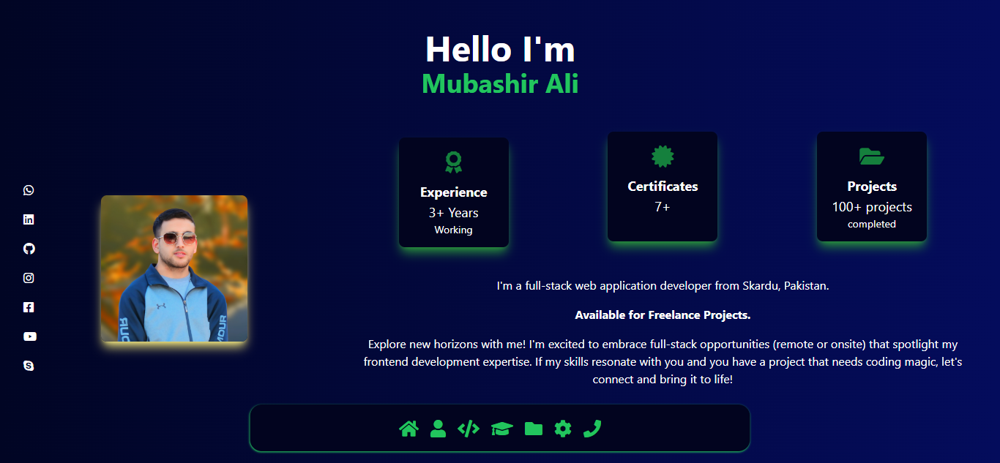
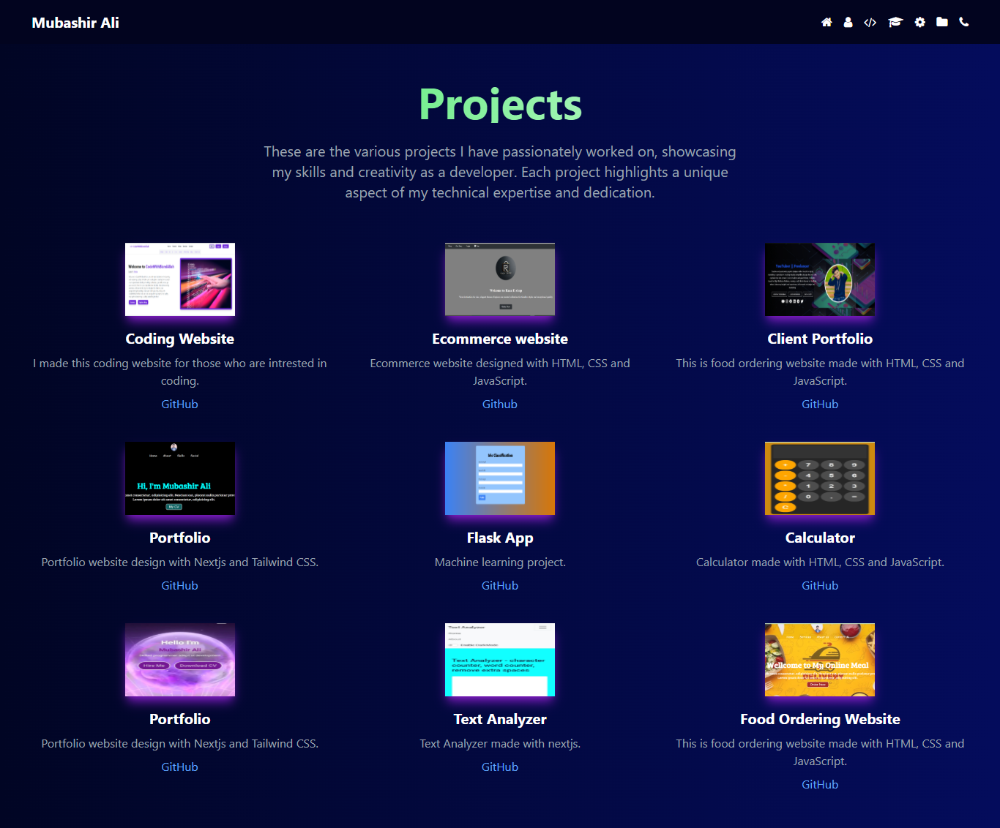
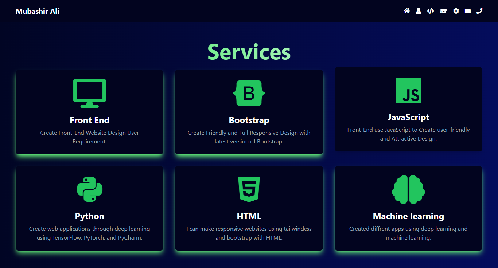
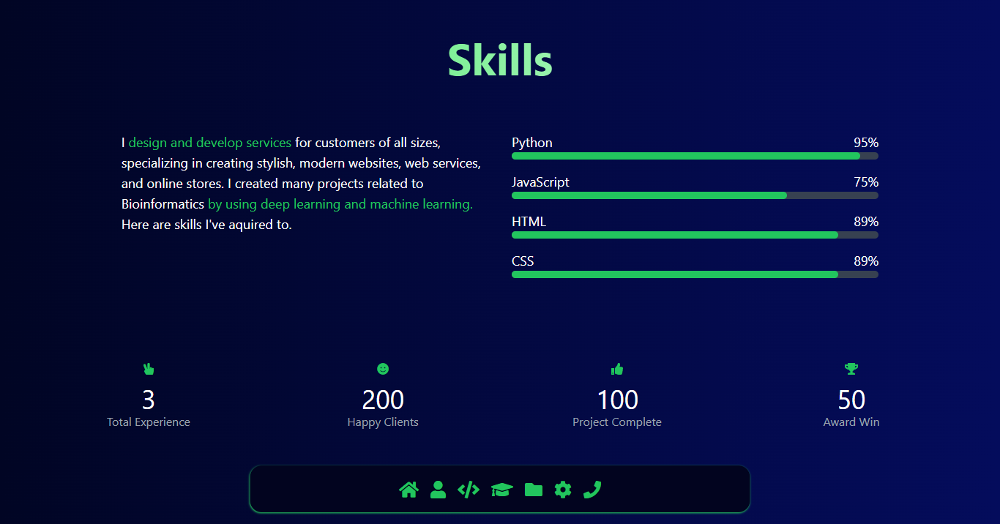
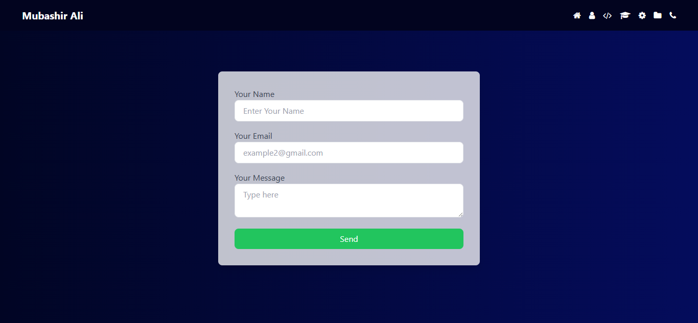

# Personal Portfolio 🔥

<!-- GitHub Repo Badges -->

:star: Star me on GitHub — it helps!

## 📈 Project Metrics

### Website Preview
#### Home Page

#### About Page

#### Educations Page

#### Projects Page

#### services Page

#### Skills Page

#### Contact Page

  

:star: Star me on GitHub — it helps!

## Features 📋
⚡️ Fully Responsive\
⚡️ Valid HTML5 & CSS3\
⚡️ TailwindCSS
⚡️ Easy to modify

## Installation & Deployment 📦
- Clone the repository and modify the content
- Add or remove images from `img/` directory as per your requirement.
- Use [Github Pages](https://create-react-app.dev/docs/deployment/#github-pages) to create your own website.
- To deploy your website, first you need to create github repository with name `<your-github-username>.github.io` and push the generated code to the `main` branch.

## Sections 📚
✔️ Home\
✔️ About\
✔️ Education\
✔️ Skills\
✔️ Experience\
✔️ Services\
✔️ Projects \
✔️ Contact Info

## Tools Used 🛠️
* <b>GitHub Pages</b> - To host my static website (HTML, CSS, JS).

## Contributing 💡
#### Step 1

- **Option 1**
    - 🍴 Fork this repo!

- **Option 2**
    - 👯 Clone this repo to your local machine.

#### Step 2

- **Build your code** 🔨🔨🔨

#### Step 3

- 🔃 Create a new pull request.

## License

- **[MIT license](http://opensource.org/licenses/mit-license.php)**
